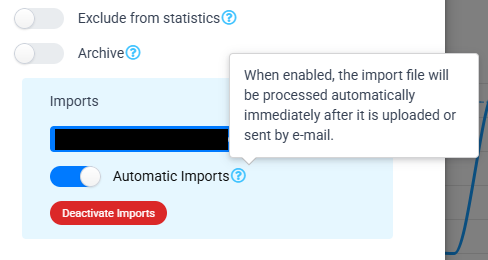

<!-- omit from toc -->
# Wallet-BudgetBakers-Import

Node.js module to import a CSV file with transactions to BudgetBakers' Wallet.

- [Installation](#installation)
- [Getting started](#getting-started)
  - [Methods](#methods)
    - [`login(username, email)`](#loginusername-email)
    - [`getImports()`](#getimports)
    - [`importFile(config)`](#importfileconfig)
    - [`upload(file, email)`](#uploadfile-email)
  - [CSV file](#csv-file)
    - [Avoiding import problems](#avoiding-import-problems)

## Installation

Install the package using npm:

```shell
npm install wallet-budgetbakers-import
```

After installing, import it into your project:

```js
import wallet from 'wallet-budgetbakers-import';
```

## Getting started

Importing a CSV file:

```js
import wallet from 'wallet-budgetbakers-import';
try {
    await wallet.login('your-email@provider.com', 'YourPassword123456');
    const result = await wallet.importFile({
        file: 'path/to/file/2022-03-20T16-20.csv',
        email: 'account-email@imports.budgetbakers.com'  
    });   
    console.log(result);    
} catch(err) {
    console.error(err);
}
```

### Methods

#### `login(username, email)`

Logs in with the provided credentials.

```js
wallet.login('your-email@provider.com', 'YourPassword123456');
```

#### `getImports()`

Retrieves an array of imported files.

```js
wallet.getImports('-Account_00000000-0000-0000-0000-000000000000');
```

By providing an account identification, the result will be filtered accordingly. The id can be found in the URL, when navigating to the account detail, in Wallet's web app.

#### `importFile(config)`

Imports an CSV file.

```js
wallet.importFile({
    file: 'path/to/file/2022-03-20T16-20.csv',
    email: 'account-email@imports.budgetbakers.com',
    accountId: '-Account_00000000-0000-0000-0000-000000000000',
    newRecordsOnly: false
}); 
```

The following is a list of the available configuration values:

| Property | Definition |
| :--------: | ---------- |
| `file` | Path to the file to import |
| `email` | Account's import e-mail. You can find it in your account's settings |
| `accountId` | Optional; specifies to which account the transactions will be imported |
| `newRecordsOnly` | Defaults to `true`; only new transactions will be imported. For it to work properly, make sure your file's name has the `YYYY-MM-DDTHH-MM` format, for example: `2022-03-20T16-20` |

#### `upload(file, email)`

Upload the CSV file to Wallet `Imports` section.

> [!NOTE]
> Since this function is **used internally** by [`importFile(config)`](#importfileconfig), usually you wouldn't need it.
>
> However, Wallet imports now have a feature called "Automatic imports" which allow processing the CSV as soon as it is uploaded to the interface:
>
> 
>
> This function may come in handy in case you decide to enable this feature.

### CSV file

A minimal file with transactions may be the following:

```csv
date,note,amount,expense
2023-03-15T10:30:00.000Z,0,1.99
2023-03-07T15:00:00.000Z,200.00,0
```

The following is a complete list of CSV values you can use to import your data:

| Header name | Required? |    Value type   | Examples                     |
|:-----------:|:---------:|:---------------:|------------------------------|
| `date`      | Yes       | ISO date string | `"2023-03-15T10:30:00.000Z"` |
| `amount`    | Yes       | Decimal number  | `123.45`, `10`               |
| `expense`   | Yes       | Decimal number  | `123.45`, `10`               |
| `currency`  | No        | String          | `"USD"`, `"EUR"`             |
| `note`      | No        | String          | `"This is a note"`           |
| `payee`     | No        | String          | `"shop@example.com"`         |

#### Avoiding import problems

In order to avoid problems during the import please follow the following rules:

- `date` MUST be in a standard ISO format, comprehensive of timezone info, otherwise the Wallet API will ject > the CSV as invalid
- `amount` and `expense` are mutually exclusive, they CAN NOT be set at the same time!
  
  The following is an **invalid CSV** and the *import will fail*:
    
    ```csv
    date,amount,expense
    2023-03-15T10:30:00.000Z,200.14,1.99
    ```
  
  To **fix** we must split the two values into **separate records** (date may be the same):
    
    ```csv
    date,amount,expense
    2023-03-15T10:30:00.000Z,200.14,0
    2023-03-15T10:30:00.000Z,0,1.99
    ```
